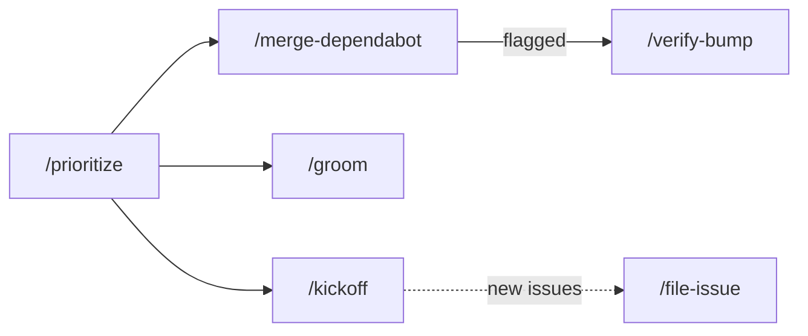
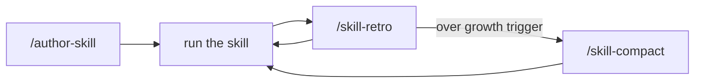
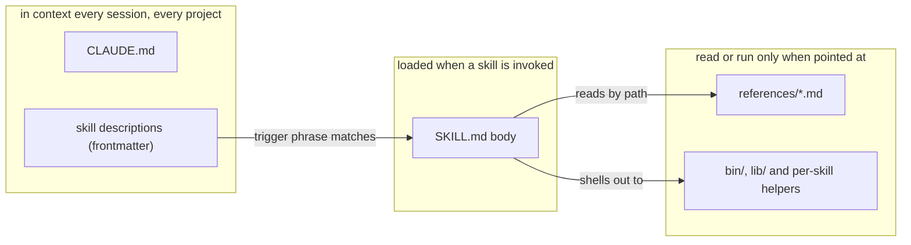
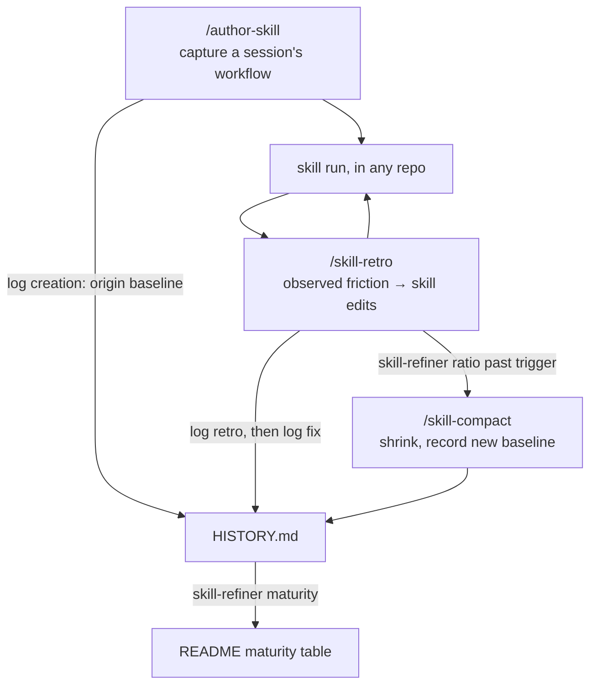

# Claude Code Config

Shared skills and configuration for Claude Code, versioned as `~/.claude`.
Primarily versioning my own setup, but meant to be usable by others —
fork it and make it yours.

## Skills

### Repo upkeep

| Skill | Summary | Suggested model | Maturity |
| --- | --- | --- | --- |
| [`prioritize`](skills/prioritize/SKILL.md) | Decide what to work on next across your GitHub repos. | Sonnet | 🧪 Experimental |
| [`kickoff`](skills/kickoff/SKILL.md) | Pick the one thing to start with in the repo you just entered. | Opus | 🟢 Usable |
| [`merge-dependabot`](skills/merge-dependabot/SKILL.md) | Clear the Dependabot PRs that are actually safe to merge. | Sonnet | 🧪 Experimental |
| [`verify-bump`](skills/verify-bump/SKILL.md) | Land a dependency bump that green CI alone doesn't prove safe. | Opus | 🟢 Usable |
| [`groom`](skills/groom/SKILL.md) | Clear the dead and duplicated issues out of one repo's backlog. | Opus | 🧪 Experimental |
| [`file-issue`](skills/file-issue/SKILL.md) | File an issue someone could start cold, or refine a rough one to that bar. | Opus | 🟢 Usable |

### Repo setup & toolchain

| Skill | Summary | Suggested model | Maturity |
| --- | --- | --- | --- |
| [`add-devcontainer`](skills/add-devcontainer/SKILL.md) | Pin a repo's toolchain in a devcontainer and run CI inside it. | Opus | 🚧 WIP |
| [`add-dependabot`](skills/add-dependabot/SKILL.md) | Set up a repo's Dependabot config so bumps arrive in mergeable batches. | Sonnet | 🚧 WIP |
| [`upgrade-toolchain`](skills/upgrade-toolchain/SKILL.md) | Move a pinned toolchain version across every place a repo pins it. | Sonnet | 🚧 WIP |

### Skill lifecycle

| Skill | Summary | Suggested model | Maturity |
| --- | --- | --- | --- |
| [`author-skill`](skills/author-skill/SKILL.md) | Capture a session's workflow as a new skill, or refine an existing one. | Fable | 🧪 Experimental |
| [`skill-retro`](skills/skill-retro/SKILL.md) | Improve a skill right after running it, from observed friction. | Opus | 🟢 Usable |
| [`skill-compact`](skills/skill-compact/SKILL.md) | Shrink a skill that has accreted more rules than it needs. | Opus | 🧪 Experimental |

### Session helpers

| Skill | Summary | Suggested model | Maturity |
| --- | --- | --- | --- |
| [`grilling`](skills/grilling/SKILL.md) | Stress-test a plan or idea through relentless questioning. | Opus | 🧪 Experimental |
| [`pick-model`](skills/pick-model/SKILL.md) | Pick the cheapest Claude model that still fits the task. | Sonnet | 🧪 Experimental |
| [`claude-md-compact`](skills/claude-md-compact/SKILL.md) | Shrink `CLAUDE.md` when global preferences have accreted. | Opus | 🧪 Experimental |

Maturity: 🚧 WIP → 🧪 Experimental → 🟢 Usable → 🛡️ Battle-tested — judged
from each skill's history log by `/skill-retro`; the promotion bars live in
[`bin/skill-refiner`](bin/skill-refiner/Maturity.fs).

"Suggested model" is the model to *run* a skill with. Writing or refining a
skill is different — switch to the most capable model first; the threshold and
rationale live in
[references/skill-conventions.md](references/skill-conventions.md).

## Workflows

Some skills are meant to run in sequence. These are starting points, not fixed
pipelines — each skill also stands alone.

**Setting a repo up** (once) — run `/add-devcontainer`, then
`/add-dependabot`.

**Working on repos** (every session)



- Start with `/prioritize`, then `cd` into the repo it points at:
  - dependency bumps → `/merge-dependabot`; for a flagged bump you still want
    to land, `/verify-bump <n>`
  - an issue list you can no longer hold in your head → `/groom`
  - choosing what to start on → `/kickoff`
  - issues that come out of the work → `/file-issue`, which also refines a
    rough one
- Dependabot doesn't move the versions `/add-devcontainer` pinned; when a
  toolchain is out of date, run `/upgrade-toolchain`.

**Skills**



- **Capturing a workflow** — run `/author-skill` in the session that revealed
  it, while the context is fresh. A workflow specific to one project lands in
  that repo's `.claude/skills`.
- **Refining after use** — below 🛡️ Battle-tested, run `/skill-retro` in the
  same session after every run; past it, on demand. A retro is the only thing
  that logs a run, so a skill nobody retros never earns the top rung. When it
  reports the skill over the growth trigger, run `/skill-compact` as a separate
  pass.
- **Project skills** work the same: run the commands from inside that repo, and
  the log, edits, and maturity table (`.claude/skills/README.md`) land beside
  the skill.

**Global preferences** — nothing tracks `CLAUDE.md` growth for you. Check with
`wc -w ~/.claude/CLAUDE.md` and run `/claude-md-compact` once it is well past
~500 words.

## Setup

```sh
git clone https://github.com/NicoVIII/claude-config.git ~/.claude
```

If `~/.claude` already exists:

```sh
cd ~/.claude
git init -b main
git remote add origin https://github.com/NicoVIII/claude-config.git
git pull origin main
git branch --set-upstream-to=origin/main main
```

`git pull` refuses to overwrite untracked files, so move an existing
`CLAUDE.md`, `README.md`, or `skills/` aside first and merge back what you want
to keep.

## After cloning

- Or skip the installing: open the repo in its
  [devcontainer](.devcontainer/devcontainer.json) and everything below is already
  there at a pinned version. It bind-mounts the host's `~/.claude`, so Claude
  Code inside the container shares your skills, memory **and login** read-write —
  convenient for working on this config, not a sandbox.
- Install what the skills shell out to: [`gh`](https://cli.github.com/),
  authenticated (`prioritize`, `merge-dependabot` and `verify-bump` are built on
  it), the [.NET SDK](https://dotnet.microsoft.com/download) 10 or newer
  (`prioritize`'s gather step, `merge-dependabot`'s survey step and the shared
  `bin/skill-refiner` are F# programs — the last makes it a prerequisite of the
  skill-authoring workflow, not just of one skill), and `rg` (ripgrep).
- To work *on* this repo you also need [`just`](https://just.systems) and
  [`lefthook`](https://lefthook.dev); run `lefthook install` once to activate
  the pre-commit typecheck. `just check` runs it by hand. Neither is needed to
  merely use the skills.
- Add your `settings.json` manually — it is gitignored and not tracked, because
  it holds machine preferences (`theme`, `tui`, `effortLevel`) that the
  `/config` menu rewrites. The permission allowlist is the one part worth
  versioning, so it lives in `permissions.json`; `just sync-permissions` copies
  it in, replacing whatever `.permissions` is there. Re-run it after editing.
- Use `settings.local.json` for secrets and machine-specific overrides (also gitignored).
- `.claude/settings.json` is committed and applies only while working *in* this
  repo: it allows `just check` and the `dotnet run` behind it, so the checks
  below do not prompt.
- If you are not me: `CLAUDE.md` holds *my* personal preferences and loads
  into every Claude Code session — review it and replace what isn't yours.

## Contents

- `CLAUDE.md` — global personal preferences, loaded into every Claude Code session; applies automatically after cloning
- `references/` — guardrails for working on this repo and on its skills; nothing auto-loads them, so the skills that need one point at it by path
- `skills/` — slash-command skills for Claude Code, see the table above; each
  follows the [Agent Skills](https://agentskills.io/specification) layout, so a
  skill folder — `SKILL.md` plus its `scripts/` — is portable to any agent that
  reads the standard, except where an F# helper reaches out to `bin/` or `lib/`;
  the `HISTORY.md` beside it is this config's own addition, see
  [The history log](#the-history-log)
- `bin/` — runnable helpers shared by several skills, rather than owned by one,
  and so belonging to no skill folder
- `lib/` — the same, minus an entry point: code the helpers reference but
  nobody runs directly

## Concept

Two ideas drive the structure. First, **context is billed**: anything that
auto-loads — `CLAUDE.md`, every skill's frontmatter `description` — costs
tokens in every session, so each fact lives at the least-loaded level that
still reaches its reader. Trigger phrases go in the description, procedure in
the SKILL.md body, shared conventions in `references/` files read by path, and
fixed pipelines into compiled helpers, because prose that makes a model
reproduce a pipeline reloads every run and regresses where a program doesn't.



Second, **skills are maintained like code**: every run leaves evidence, the
evidence drives edits, and growth is measured so accretion has a counter-force.
`/skill-retro` turns a run's observed friction into edits and logs both how the
run went and what the edit did to the skill's `HISTORY.md`; `bin/skill-refiner`
rates maturity from that log and reports growth since the last size anybody
settled on deliberately; `/skill-compact` is the separate pass that
shrinks — separate because removing text in the same pass that fixes friction
is how the friction always wins.



### The history log

The `HISTORY.md` beside a `SKILL.md` is that evidence, appended to by the
skills above and by nothing else. One line per event:

```
2026-08-03 · claude-config · 1233 words · fix big: failure branch now …
```

— the date, the repo the run happened in, the SKILL.md's size at that moment,
and what happened: `created`, `retro clean|minor|major`, `fix small|big`, or
`compacted`. Three readers depend on that shape, which is why the file is
written only through `~/.claude/bin/skill-refiner.sh <skill> log …` and never by
hand, and why earlier lines are never rewritten:

- `skill-refiner maturity` rates the skill from the run grades since the last
  major retro — and, for 🛡️ Battle-tested, since the last big fix too, and from
  how many repos those runs came from, which is what the repo field is for.
- `skill-refiner ratio` measures growth against the last deliberate size
  (`created` or `compacted`), so the word counts have to be a gap-free series.
- the next `/skill-retro` searches the clauses for a mechanism that already
  failed once, and treats a repeat as evidence against the mechanism rather
  than its wording — hence clauses that name the mechanism, not the symptom.

All three run out of this repo, so a project skill's log needs a clone of it (or
your fork) in `~/.claude` plus the .NET SDK. The log itself commits into the
project repo and travels with the skill; without this config a collaborator can
still read it, but it degrades to a changelog nothing rates. Since nobody there
has read this section, the first entry logged into a project tree seeds a
`.claude/skills/README.md` beside it saying the same thing for that audience —
[`bin/skill-refiner/ProjectSkillsReadme.md`](bin/skill-refiner/ProjectSkillsReadme.md)
is the text, planted once and never overwritten. It also carries that tree's
maturity table, the counterpart of the one above and the only place a project
skill's suggested model is recorded. It arrives with headers and no rows: the
rating comes from the log, but the summary and the model do not, so
`skill-refiner maturity` asks for the row rather than inventing one. Seeding
also names the skills already sitting in that tree: the empty table lists none
of them, and nothing else in the loop reaches a skill that is never logged.

Credits: [`grilling`](skills/grilling/SKILL.md) is based on
<https://github.com/mattpocock/skills> (MIT License). Attributions live here
rather than in a `SKILL.md`, which loads into context on every invocation.
