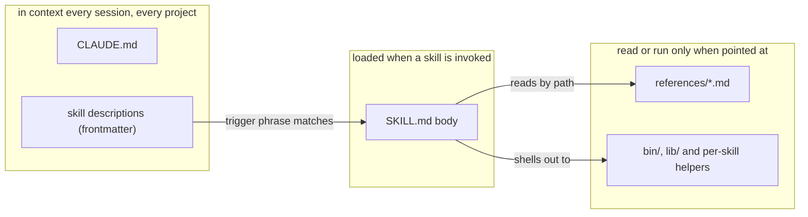
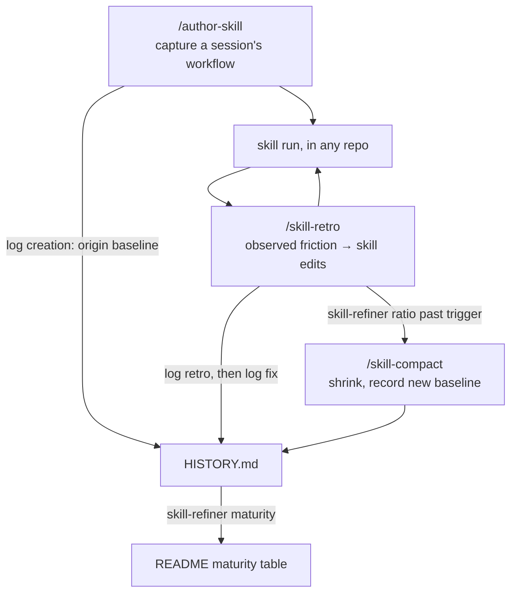

# Claude Code Config

Shared skills and configuration for Claude Code, versioned as `~/.claude`.
Primarily versioning my own setup, but meant to be usable by others —
fork it and make it yours.

## Skills

| Skill | Summary | Suggested model | Maturity |
| --- | --- | --- | --- |
| [`add-dependabot`](skills/add-dependabot/SKILL.md) | Set up a repo's Dependabot config so bumps arrive in mergeable batches. | Sonnet | 🚧 WIP |
| [`add-devcontainer`](skills/add-devcontainer/SKILL.md) | Pin a repo's toolchain in a devcontainer and run CI inside it. | Opus | 🚧 WIP |
| [`author-skill`](skills/author-skill/SKILL.md) | Capture a session's workflow as a new skill, or refine an existing one. | Fable | 🧪 Experimental |
| [`claude-md-compact`](skills/claude-md-compact/SKILL.md) | Shrink `CLAUDE.md` when global preferences have accreted. | Opus | 🧪 Experimental |
| [`grilling`](skills/grilling/SKILL.md) | Stress-test a plan or idea through relentless questioning. | Opus | 🧪 Experimental |
| [`groom`](skills/groom/SKILL.md) | Clear the dead and duplicated issues out of one repo's backlog. | Opus | 🚧 WIP |
| [`merge-dependabot`](skills/merge-dependabot/SKILL.md) | Clear the Dependabot PRs that are actually safe to merge. | Sonnet | 🧪 Experimental |
| [`pick-model`](skills/pick-model/SKILL.md) | Pick the cheapest Claude model that still fits the task. | Sonnet | 🧪 Experimental |
| [`prioritize`](skills/prioritize/SKILL.md) | Decide what to work on next across your GitHub repos. | Sonnet | 🧪 Experimental |
| [`skill-compact`](skills/skill-compact/SKILL.md) | Shrink a skill that has accreted more rules than it needs. | Opus | 🧪 Experimental |
| [`skill-retro`](skills/skill-retro/SKILL.md) | Improve a skill right after running it, from observed friction. | Opus | 🟢 Usable |
| [`upgrade-toolchain`](skills/upgrade-toolchain/SKILL.md) | Move a pinned toolchain version across every place a repo pins it. | Sonnet | 🚧 WIP |
| [`verify-bump`](skills/verify-bump/SKILL.md) | Land a dependency bump that green CI alone doesn't prove safe. | Opus | 🧪 Experimental |

Maturity: 🚧 WIP → 🧪 Experimental → 🟢 Usable → 🛡️ Battle-tested — judged
from each skill's history log by `/skill-retro`; the promotion bars live in
[`bin/skill-refiner`](bin/skill-refiner/Maturity.fs).

"Suggested model" is the model to *run* a skill with. Writing or refining a
skill is different — switch to the most capable model first; the threshold and
rationale live in
[references/skill-conventions.md](references/skill-conventions.md).

## Workflows

Some skills are meant to run in sequence:

- **Session triage** — `/prioritize` scans your repos and decides what to work
  on. When it surfaces dependency bumps, `cd` into that repo and run
  `/merge-dependabot` to clear the ones CI actually verifies; for a flagged
  bump you still want to land, follow up with `/verify-bump <n>`. When it
  points at a repo whose issue list has outgrown what you can hold in your
  head, `/groom` clears the dead and duplicated issues there — it never ranks
  anything, so the two stay disjoint.
- **Setting a repo up** — `/add-devcontainer` pins the toolchain and points CI
  at it; `/add-dependabot` then watches what that toolchain depends on. Run in
  that order: the devcontainer decides which ecosystems exist to watch. The PRs
  it produces are what Session triage above clears.
- **Keeping the toolchain current** — Dependabot never bumps the versions
  `/add-devcontainer` pinned: it updates a feature's tag, not the `version`
  inside it, and cannot see a CI env var or a Dockerfile `ARG` at all. So those
  pins move by hand — `/upgrade-toolchain` moves all of them together and
  verifies the result.
- **Capturing a workflow as a skill** — when a session in any project reveals a
  repeatable workflow, run `/author-skill` while the context is fresh — the
  transcript holds the commands, quirks, and decisions the skill should encode.
  Later runs feed `/skill-retro` as usual.
- **Refining a skill after use** — after running any skill below 🟢 Usable, run
  `/skill-retro` in the same session to turn the friction you hit into concrete
  skill edits (this is what the skills' feedback footer feeds); past 🟢 Usable,
  run it on demand. `/skill-retro` only ever adds, so it also reports how far
  the skill has grown past its baseline — when it says the skill is over the
  trigger, run `/skill-compact` on it as a separate pass.
- **Trimming global preferences** — `CLAUDE.md` accretes the same way, but from
  ordinary sessions rather than a skill, so nothing announces its growth
  (`skill-refiner`'s ratio only measures skills). Check it by hand with
  `wc -w ~/.claude/CLAUDE.md` and run `/claude-md-compact` once it has drifted
  well past ~500 words.

These are starting points, not fixed pipelines — each skill also stands alone.

## Setup

```sh
git clone https://github.com/NicoVIII/claude-config.git ~/.claude
```

If `~/.claude` already exists:

```sh
cd ~/.claude
git init -b main
git remote add origin https://github.com/NicoVIII/claude-config.git
git pull origin main
git branch --set-upstream-to=origin/main main
```

`git pull` refuses to overwrite untracked files, so move an existing
`CLAUDE.md`, `README.md`, or `skills/` aside first and merge back what you want
to keep.

## After cloning

- Or skip the installing: open the repo in its
  [devcontainer](.devcontainer/devcontainer.json) and everything below is already
  there at a pinned version. It bind-mounts the host's `~/.claude`, so Claude
  Code inside the container shares your skills, memory **and login** read-write —
  convenient for working on this config, not a sandbox.
- Install what the skills shell out to: [`gh`](https://cli.github.com/),
  authenticated (`prioritize`, `merge-dependabot` and `verify-bump` are built on
  it), the [.NET SDK](https://dotnet.microsoft.com/download) 10 or newer
  (`prioritize`'s gather step, `merge-dependabot`'s survey step and the shared
  `bin/skill-refiner` are F# programs — the last makes it a prerequisite of the
  skill-authoring workflow, not just of one skill), and `rg` (ripgrep).
- To work *on* this repo you also need [`just`](https://just.systems) and
  [`lefthook`](https://lefthook.dev); run `lefthook install` once to activate
  the pre-commit typecheck. `just check` runs it by hand. Neither is needed to
  merely use the skills.
- Add your `settings.json` manually — it is gitignored and not tracked.
- Use `settings.local.json` for secrets and machine-specific overrides (also gitignored).
- If you are not me: `CLAUDE.md` holds *my* personal preferences and loads
  into every Claude Code session — review it and replace what isn't yours.

## Contents

- `CLAUDE.md` — global personal preferences, loaded into every Claude Code session; applies automatically after cloning
- `references/` — guardrails for working on this repo and on its skills; nothing auto-loads them, so the skills that need one point at it by path
- `skills/` — slash-command skills for Claude Code, see the table above; each
  follows the [Agent Skills](https://agentskills.io/specification) layout, so a
  skill folder — `SKILL.md` plus its `scripts/` — is portable to any agent that
  reads the standard
- `bin/` — runnable helpers shared by several skills, rather than owned by one,
  and so belonging to no skill folder
- `lib/` — the same, minus an entry point: code the helpers reference but
  nobody runs directly

## Concept

Two ideas drive the structure. First, **context is billed**: anything that
auto-loads — `CLAUDE.md`, every skill's frontmatter `description` — costs
tokens in every session, so each fact lives at the least-loaded level that
still reaches its reader. Trigger phrases go in the description, procedure in
the SKILL.md body, shared conventions in `references/` files read by path, and
fixed pipelines into compiled helpers, because prose that makes a model
reproduce a pipeline reloads every run and regresses where a program doesn't.



Second, **skills are maintained like code**: every run leaves evidence, the
evidence drives edits, and growth is measured so accretion has a counter-force.
`/skill-retro` turns a run's observed friction into edits and logs both how the
run went and what the edit did to the skill's `HISTORY.md`; `bin/skill-refiner`
rates maturity from that log and reports growth since the last size anybody
settled on deliberately; `/skill-compact` is the separate pass that
shrinks — separate because removing text in the same pass that fixes friction
is how the friction always wins.



Credits: [`grilling`](skills/grilling/SKILL.md) is based on
<https://github.com/mattpocock/skills> (MIT License). Attributions live here
rather than in a `SKILL.md`, which loads into context on every invocation.
